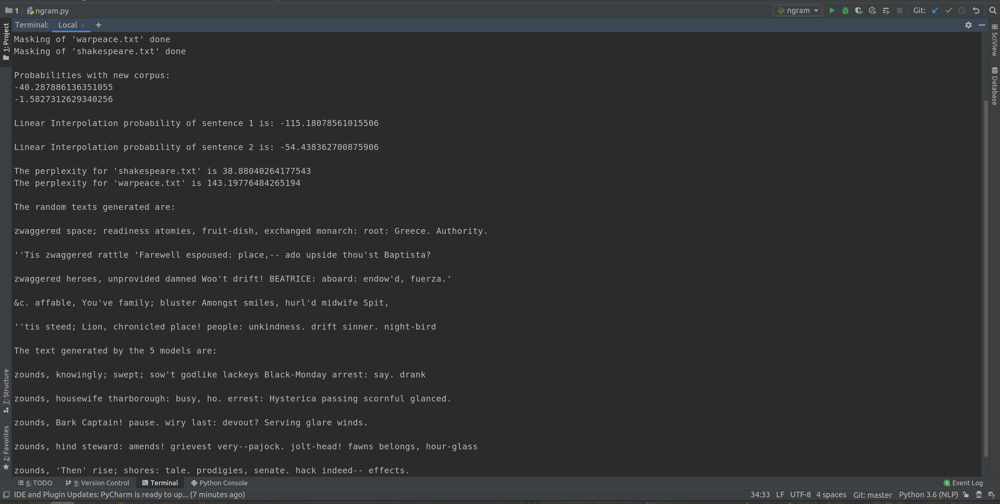

### Text-Generation-using-NGRAM-models
Generating text using N-gram models that were trained on shakespeare.txt and warpeace.txt

#### Overview of the code:
- Find out all the contexts (n-1 preceding words) of the words in the train set.
- Before starting, pad the text with start and stop tokens.
- Keep a count for the ngram, contexts and store all the words seen in the corpus.
- Now we need to predict word and sentence probabilities.
- If the context is previously unseen, set the probability to 1/size(vocab)
- To predict the probability of a sentence, we multiply its n-gram probabilities.
- To  handle the case of unseen words in the test corpus, we will replace all of the words in the training corpus with a token <unk> and compute the counts again.
- For an unseen word in the test corpus, we will use the count for <unk> tokens.
- Apply Laplace smoothing to Bi-gram models and evaluate again. It does not perform very well as it gives uniform probability (delta) to all the words.
- Use Linear Interpolator where we take compute all the n-grams from 1 to n and assign each one a probability (lambda). This helps is generalizing the text better. 
- However, it is slower as it builds multiple models.
- We then computed the perplexities of the N-gram models. Perplexity is a measurement of how well a probability distribution or probability model predicts a sample. It may be used to compare probability models. A low perplexity indicates the probability distribution is good at predicting the sample.
- The models were trained on shakespeare.txt and warpeace.txt and were tested on sonnets.txt
- The last step was to generate some text. We ordered the vocabulary dictionary alphabetically and gave each word a probability based on the context, such that the probabilities of all the words sum up to 1.
- Generate a random number r∈[0.0,1.0) using random.random(). Imagine a number line from 0.0 to 1.0, the space on that number line can be divided up into zones corre-sponding to the words.
- For example, if the first words are “apple” and “banana,”with probabilities 0.09 and 0.57, respectively, then [0.0, 0.9) belongs to “apple” and[0.9, 0.66) belongs to “banana,” and so on.  Return the word whose zone contains r.
- Once we can generate words, we can generate sentences. Wrote a function randomtext(model,maxlength, delta=0) that generates up to max length words, using the previously generated words as context for each new word. However, the sentence generated did not make much sense.
- Train  four  models  –  one  bigram,  one  trigram,  one  4-gram,and one 5-gram – on shakespeare.txt and generated the likeliest sentence for each one using maxlength = 10.

#### Running the code:
Install requirements
```pip install -r requirements.txt```

Run the code
```python ngram.py```

#### Output:

